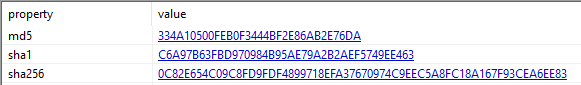
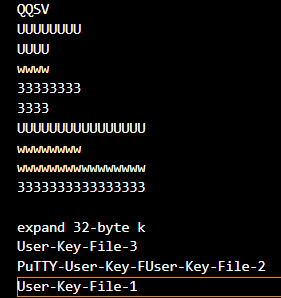
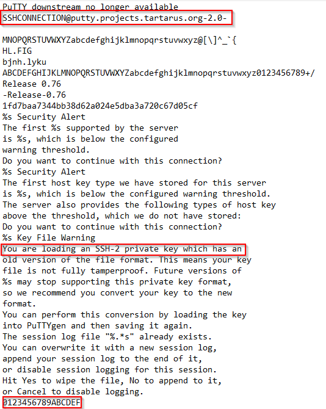
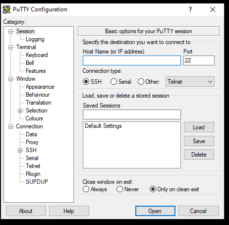
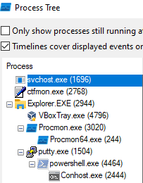
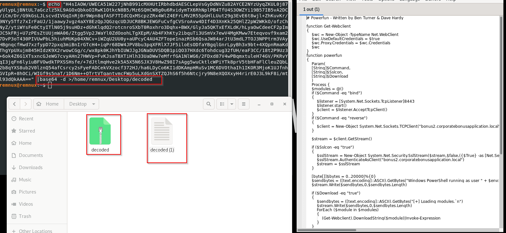

# SillyPutty

Hello Analyst,

The help desk has received a few calls from different IT admins regarding the attached program.They say that they've been using this program with no problems until recently. Now, it's crashing randomly and popping up blue windows when its run. I don't like the sound of that. Do your thing!

IR Team

### Objective
---
Perform basic static and basic dynamic analysis on this malware sample and extract facts about the malware's behavior

### Basic Static
---
our first look would be on **file hashes & Virus Total**

from **PEStudio** we get our hashes 

On droping **SHA256** in **Virus Total** we found that 61 security vendors and 1 sandbox flagged this file as malicious.
and found also that tiny list of imports which not good at all.

Other piece of information is **" PE32 executable (GUI) Intel 80386, for MS Windows"**
Checking strings I noteced some strange patterns the most important was 

Those strings are not enough to gudge any thing those are somehow died 
so the last thing to check in string is the blinking blue screen mentioned up there 
so we can grep **"powershell"** from our strings and guess what I found   

Here we go for our imports **IAT** let's have a look in **PEStudio or PE-View** 
sadlly there is nothing more than i found in Virus Total just normal imports dealing with the Windows Registry that may be notable, but PuTTY's normal functions can also manipulate the registry. The IAT has plenty of imports to look at, but there is not enough information to make a determination yet.

so now we have known that the file is unpacked and executable and we doubt some behaviours.

let's take the next step in dynamic analysis.

### Dynamic Analysis
On initial detonation it opened a normal dialog window

after entering an IP it desplayed an error as there is no listening SSH 

which appears to be the normal program. If you look closely, it also blinks as a blue window for a brief moment, which is in line with the scenario brief

from process tree we find that putty is parent of powershell process 
 

from wireshark we could conclude the DNS record that is queried at detonation

from tcpview we found same hash of powershell command line that we found before and on decoding it in our remnux we get a new script in human readable form that contains tons of golden information 

here after unziping the output file you will find the script
the callback port and protocol are found here 

**(8443,SSL/TLS)** you can find protocol in wireshark also

you use host-based telemetry to identify the DNS record, port, and protocol by filtering on the name of the binary and adding an additional filter of "Operation contains TCP" in procmon.

Now Attempt to get the binary to initiate a shell on the localhostand see if the shell spawn and What needed for a shell to spawn?

The shell does not blink without a proper TLS handshake, so using a basic ncat listener on port 8443 does not initiate a shell. The syntax of the PowerShell reverse shell requires TLS to complete the network transaction, so even if you use the `hosts` file and open up a listener on port 8443 to catch the incoming shell, you cannot force the binary to connect unless you can also provide a valid SSL certificate.

### Tools
Basic Static:
- File hashes
- VirusTotal
- FLOSS
- PEStudio
- PEView

Basic Dynamic Analysis
- Wireshark
- Inetsim
- Netcat
- TCPView
- Procmon

#### Written by

# *Karim Gomaa*
